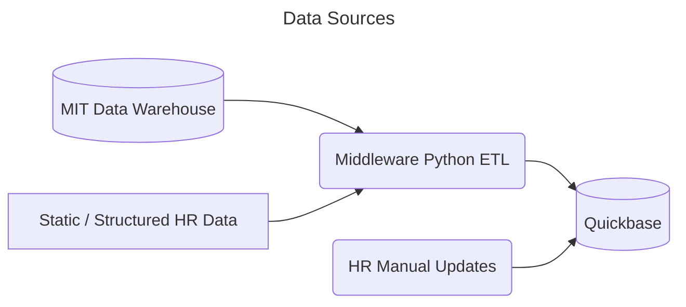

# Data Sources

There two primary sources for data that will flow into QB:

  - data from the MIT Oracle Data Warehouse (DW)
  - data managed and created by Library HR 
    - structured, static data that this integration will load programatically
    - manual entry performed by HR in QB directly

