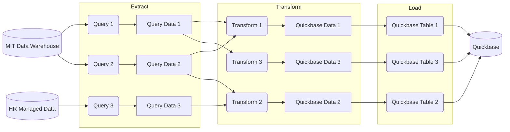

# Pipelines

The following diagram shows a high level sketch of how Extract-Transform-Load tasks are carried out in this application:

```mermaid
flowchart LR
    dw[(MIT Data Warehouse)]
    hr[(HR Managed Data)]
    qb[(Quickbase)]
    
    dw-->q1(Query 1)
    dw-->q2(Query 2)
    hr-->q3(Query 3)
    
    subgraph Extract
    q1-->qd1[Query Data 1]
    q2-->qd2[Query Data 2]
    q3-->qd3[Query Data 3]
    end

    subgraph Transform
    qd1-->t1(Transform 1)
    qd2-->t1
    qd2-->t2(Transform 2)
    qd3-->t2
    qd1-->t3(Transform 3)
    t1-->qbd1[Quickbase Data 1]
    t2-->qbd2[Quickbase Data 2]
    t3-->qbd3[Quickbase Data 3]
    end

    subgraph Load
    qbd1-->qbt1(Quickbase Table 1)
    qbd2-->qbt2(Quickbase Table 2)
    qbd3-->qbt3(Quickbase Table 3)
    end
    
    qbt1-->qb
    qbt2-->qb
    qbt3-->qb
```